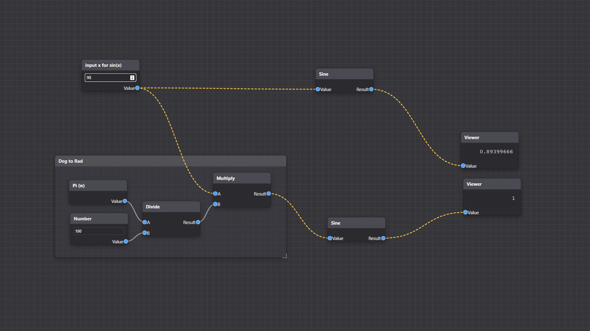

# Lambda-Flux [🚀](https://kuldeep-dilliwar.github.io/Lambda-Flux/)

> An interactive, flow-based node editor for building and evaluating mathematical expressions. Zero dependencies, pure vanilla JavaScript.

A fully interactive, client-side visual programming tool for building and evaluating mathematical expressions. This intuitive editor allows users to create, connect, and manipulate nodes to perform calculations in a graphical, flow-based environment.



## ✨ Features

*   **Interactive Canvas:** Pan and zoom the editor for a smooth and infinite workspace.
*   **Node-Based Logic:** Create nodes for inputs, mathematical operations, and outputs.
*   **Visual Connections:** Drag connections between node sockets to define the flow of data.
*   **Real-Time Calculation:** The graph automatically recalculates as you change values or connections.
*   **Data Flow Animation:** Connections pulse with a bright color to visualize data propagation.
*   **Rich Node Library:** Includes nodes for basic arithmetic, trigonometry, constants, and more.
*   **Organizational Tools:** Use `Frame` nodes to visually group and organize your graph.
*   **Intuitive Controls:** Full support for mouse and keyboard shortcuts for efficient workflow.
*   **Connection Cutting:** Quickly sever connections with a simple `Ctrl` + Drag gesture.
*   **Self-Contained:** The entire application runs from a single HTML file with no dependencies.

## 🚀 How to Use

1.  Download the `index.html` file.
2.  Open it in any modern web browser (like Chrome, Firefox, or Safari).

That's it! You can start creating and connecting nodes immediately.

## ⌨️ Controls & Shortcuts

### Mouse Controls

| Action                      | Gesture                                      |
| --------------------------- | -------------------------------------------- |
| **Pan Canvas**              | Click and drag on the empty background.      |
| **Zoom Canvas**             | Use the mouse scroll wheel.                  |
| **Select Node**             | Click on a node.                             |
| **Multi-select Nodes**      | `Shift` + Click on multiple nodes.           |
| **Move Node(s)**            | Click and drag a node's header.              |
| **Create Connection**       | Click and drag from an output socket to an input socket. |
| **Delete Connection**       | Click on a connection path.                  |
| **Cut Connections**         | `Ctrl` + Right-click and drag across connections. |
| **Open Context Menu**       | Right-click on the empty background.         |
| **Resize Frame**            | Click and drag the resizer handle at the bottom-right of a Frame node. |

### Keyboard Shortcuts

| Action                      | Shortcut            |
| --------------------------- | ------------------- |
| **Open Node Menu**          | `Shift` + `A`       |
| **Select All Nodes**        | `A`                 |
| **Delete Selected Node(s)** | `X`                 |
| **Duplicate Node(s)**       | `Shift` + `D`       |
| **Rename Active Node**      | `F2`                |


## 📦 Available Nodes

The editor comes with a built-in library of nodes accessible from the context menu (`Right-click` or `Shift + A`).

### Inputs
*   **Input:** A user-editable number field.
*   **Pi (π):** A constant node that outputs the value of Pi.
*   **Gravity (g):** A constant node that outputs the standard gravity value (9.80665).

### Operators
*   **Add:** Adds two input values.
*   **Subtract:** Subtracts the second value from the first.
*   **Multiply:** Multiplies two input values.
*   **Divide:** Divides the first value by the second.
*   **Logarithm:** Calculates the logarithm of a value with a given base.
*   **Sine:** Calculates the sine of an input value (in radians).
*   **Cosine:** Calculates the cosine of an input value (in radians).

### Output
*   **Viewer:** Displays the final computed value of any connected input.

### Utility
*   **Frame:** A resizable container to visually group other nodes. Nodes inside a frame will move with it.

## 🛠️ Code Structure

The entire application logic is encapsulated within a single `<script>` tag and organized into several key classes.

*   `NodeEditor`: The main class that orchestrates the entire editor. It manages canvas state (pan, zoom), user input, node and connection management, and the context menu.
*   `Node`: The base class for all nodes. It handles rendering, positioning, selection, renaming, and provides a common interface for inputs and outputs.
*   `Socket`: Represents an input or output connection point on a node. It manages its state (connected/disconnected) and position.
*   `Connection`: Manages the SVG path drawn between two sockets and handles the data flow animation.
*   **Node Subclasses** (`NumberNode`, `AddNode`, `FrameNode`, etc.): Each specific node type extends the base `Node` class and implements its unique `calculate()` logic.

## 🧩 How to Extend (Add a New Node)

Adding a new node is straightforward.

1.  **Create the Node Class:** Create a new class that extends `Node`.
2.  **Define Constructor:** In the constructor, call `super()` and add the necessary inputs and outputs using `this.addInput('Name')` and `this.addOutput('Name')`.
3.  **Implement `calculate()`:** Write the logic for your node in the `calculate()` method. Use `this.getInputValue(index)` to get data from inputs and `this.setOutputValue(index, value)` to send data to outputs.
4.  **Add to Context Menu:** Add your new node class to the `nodeTypes` object in the `setupContextMenu()` method within the `NodeEditor` class.

### Example: Creating a "Power" Node

Here's how you could create a node that calculates `A` to the power of `B`.

**1. Create the `PowerNode` class:**

```javascript
class PowerNode extends Node {
    constructor(editor, title, x, y) {
        super(editor, title, x, y);
        this.addInput('Base');    // Input 0
        this.addInput('Exponent'); // Input 1
        this.addOutput('Result'); // Output 0
    }
    calculate() {
        const base = this.getInputValue(0) ?? 0;
        const exponent = this.getInputValue(1) ?? 1;
        this.setOutputValue(0, Math.pow(base, exponent));
    }
}
```

**2. Add it to the `setupContextMenu` method:**

Find the `nodeTypes` object and add a new entry for your node.

```javascript
// Inside NodeEditor.setupContextMenu()
const nodeTypes = {
    'Input': (x, y) => new NumberNode(this, 'Number', x, y),
    // ... other nodes
    'Add': (x, y) => new AddNode(this, 'Add', x, y),
    'Power': (x, y) => new PowerNode(this, 'Power', x, y), // <-- Add this line
    'Subtract': (x, y) => new SubtractNode(this, 'Subtract', x, y),
    // ... other nodes
};
```

Now, "Power" will appear as an option in the context menu, and you can use it in your graphs.

## 📄 License

This project is open-source and available under the [MIT License](LICENSE).